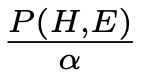

# Assignment 5 - Bayes Nets


## The Premise

After implementing your Naive Bayes Classifier, you got very interested in everything Bayes. And now you have Bayes Nets on your mind. You recently learned that many situations (robotics, medicine, criminal justice, economics, etc.) don't provide us with perfect knowledge of the world, nor are we granted the liberty of assuming state when we're ignorant of some particulars. We need to be able to reason about situations where we _don't_ have complete information and have just a few estimates for how certain pieces fit together.

When we want to reason about uncertainty, we can turn to Bayes Nets as our tool of choice. Bayes Nets, in a nutshell, let us use a bit of math to reason about the probability of a particular hypothesis being true (or false) given a set of evidence. Hypotheses are states of the world that we want to reason about, and they include things like, "Does this patient have kryptonitis?," "Is there a clear path across this room?," and the infamous "Am I being robbed, or is there an earthquake?" Evidence is world state that we know to be one way or another (true or false), such as "I know there are no chairs here," "The patient has this set of symptoms," and so on.

We reason about hypotheses (whether or not they hold) given evidence, and for Bayes Nets in particular, this manifests as questions like, "What is the probability that it isn't raining given that the grass is wet and it's cloudy?"

You find all this to be fascinating and have decided to fiddle with Bayes Nets for a while. So you've rung up your BFFs at TFF, and they've cut your work out for you.


## The Task

TFF has given you a file called `the_code.py`, which consists of a lonely little function definition for `ask()`. Right now, `ask()` doesn't do anything. Your job is to implement it.

The `ask()` function needs to return the probability of a hypothesis given some evidence: $P(H|E)$. In Intro to AI back when you went to Northwestern, you probably didn't hear of the probability of a hypothesis given some evidence but heard of the probability of a _model_ given some evidence (data). Same thing. Here, you can treat a hypothesis exactly like a model.

The `ask()` function takes four arguments:

* `var` is the name of the hypothesis variable.
* `value` indicates whether the hypothesis being asked about is `True` or `False`.
* `evidence` is the set of variables known to be `True` or `False`.
* `bn` is the `BayesNet` (in the provided module) pertaining to the problem.

To calculate $P(H|E)$, `ask()` should calculate and return


 
 where

* $P(H,E)$ is the joint probability of the $hypothesis$ (`var` = `value`) and the $evidence$ (`evidence`), and

* $\alpha$ is the Normalization Constant (the joint probability of the $hypothesis$ and the $evidence$ plus the joint probability of $\neg hypothesis$ and the $evidence$). 

More details on how to calculate $P(H,E)$ and $\alpha$ follow.


## The Testing

The tests provided by TFF use the Burglary model that's commonly discussed in Bayes Nets discussions. You should be able to easily create more test cases with this model to test the robustness of your implementation. Additionally, you are encouraged (not required) to create your own instance of `BayesNet` that models a different domain (e.g., cavities, traffic, or exam grades).


## Notes

### On Joint Probability

To calculate joint probability, we can break things down into terms that we can just look up in the `BayesNet`.  For example, the Burglary model does not represent $P(b,e,a)$, but it does have $P(b)$, $P(e)$, and $P(a|b,e)$.

We can handle this recursively by recognizing that per the Chain Rule, $P(b,e,a) = P(b)  P(e,a|b)$.
 
Similarly, we know that $P(e,a|b) = P(e|b)  P(a|b,e)$.

When calculating joint probability, we need to include all the variables that may influence the final result.  This includes all the variables that are parents of the variables in the call to `ask()`.  For example, in calculating $P(b,j,m)$, we need to include $A$ and $E$ (whose values we do not know; more on that in a bit). In fact, we can add in all the variables in the `BayesNet`, as the extra unknown variables do not affect the final result. They only add a little extra computation.

To implement the recursion, you may want to introduce a new function that takes the list of variables in the joint probability and the collection of all known variable values.  For example, for $P(e,a|b)$, the function can take the list `[E, A]` as the list of variables.  The known variable values can be represented with the dictionary `{'E': True, 'A': True, 'B': True}`.

The new function should handle the following conditions:

* Recursion can end if there are no more variables in the list.
* The next variable in the list has a known value (it is in the evidence). 
* The value of the next variable is not known.

In the case where the next variable has a known value, we can look the probability up in the Conditional Probabibility Table (CPT) using the function `probability()` in `BayesNode`. We can then recurse on the rest of the variables.

If the value of the next variable is not known, we need to compute the sum of the joint probabilities when the unknown is true and when it is false. In other words, when trying to calculate $P(B,e,a)$ given unknown $B$ and known $e$ and $a$, $P(B,e,a) = P(b,e,a) + P(\neg b,e,a) = P(b)P(e,a|b) + P(\neg b)P(e,a|\neg b)$.  For each of the two possibilities (i.e., the two components on the right-hand side), we can look the probability of the unknown up in the CPT and recurse.  Note that when recursing, we have now defined a value for the first variable, and this value needs to be included in the recursive call.

In calculating joint probability, it is best to process the variables in order.  If the list of variables is ordered such that the parent of any variable precedes its children, then when processing the child, we will already know the value of the parent.  For example, in calculating $P(a,B,e)$, if we order the variables such that we calculate $P(B,e,a)$, then when processing `a`, we will have specified a value for $B$ and can thus look the value of $P(a|b,e)$ up.

To get the list of variables in order and to get the whole list of variables, use `BayesNet.variables`.


### Variables and known values

In code, we represent the values of variables as a dictionary keyed on the _name_ of the variable.  The value of the dictionary entry is either `True` or `False`. 

An example:

```
{
  'Alarm': True, 'Burglar': False, 'Earthquake': False,
  'JohnCalls': False, 'MaryCalls': False
}
```

This representation is used for the `evidence` argument in the call to `ask()`. In making your recurive function call, you will want to take the given evidence and update it (in the third case described above, where the value of the next variable is not known). You may notice that quite a few variables are going to be left out, and this is okay, as Bayes' Theorem works just fine with unknowns (since that's the point!).


### On the Normalization Constant

The Normalization Constant is the sum of: (1) the joint probability of the $hypothesis$ and the $evidence$ and (2) the joint probability of $\neg hypothesis$ and the $evidence$. For example, the Normalization Constant $\alpha$ for $P(a|b)$ is given by $$\alpha = P(a,b) + P(\neg a,b)$$


### On the BayesNet module

The most important field for a `BayesNet` (the class in `bayesnet.py` that
represents a Bayes Net) is the `variables` field, which is an iterator of all of the
variables in the net.

Each variable in a `BayesNet` is an instance of `BayesNode`, of which, the most important fields are `name` and `evidence`.  You will also need to use the `probability()` function to look probabilities up in the CPT.
